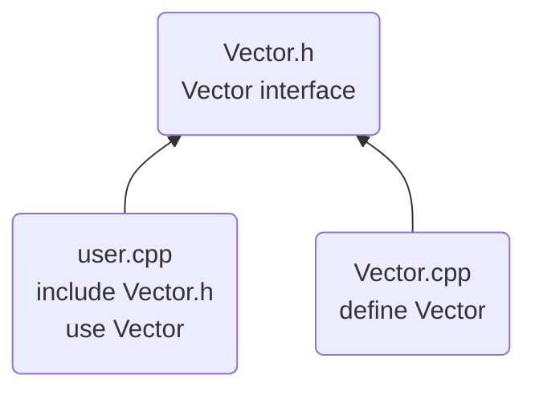
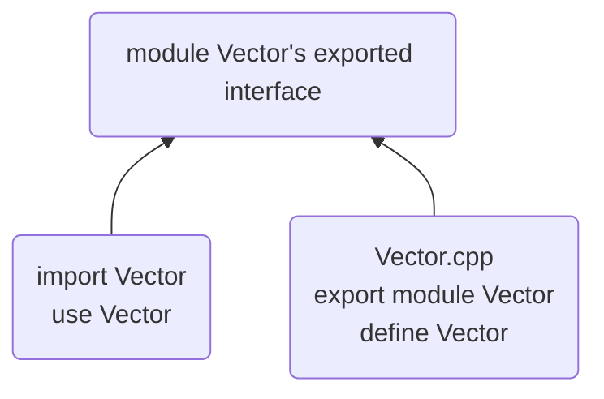

#header #module #library #namespaces #functionArguments #returnValues

---
# Introduction
The most important step to clearly define the interactions among C++ components (functions, user-defined types, class hierarchies, templates) is to distinguish between the interface to a part and its implementation.

One entity can have many declarations, but only one definition.

---
# Separate Compilation
It can be done in 2 ways:
- Place declarations in separate files, called _header files_, and `#include` them where needed.
- Define _module files_, compile them separately, and `import` them where neede.

Cons:
- Minimize compilation time
- Separate logically distinct parts `->` less error
	-_code hygiene_ (cute term ><)

_Library_: collection of separately compiled code fragments (e.g. functions)

## Header Files
Traditionally, in _header files (HF)_ we place declarations that specify the interface to a piece of code we consider a module.

A _cpp_ file (compiled by itself) and the HFs it includes consist a _translation unit_.

HFs is a very old way of simulating modularity. 
__Disadvantages__ of HFs:
1. __Compilation time__: If you `#include` a HF in 101 translation units, it will be compiled 101 times.
2. __Order dependencies__: If you `#include` HF2 before HF1, that may affect the meaning of the code.
3. __Inconsistencies__: Defining an entity in one file and then doing it again in another file slightly differently can lead to crashes and subtle errors.
4. __Transitivity__: HFs including other HFs leads to code bloat.

## Modules
In `C++20` we can express modularity using `modules`.

Modules vs Headers:
1. A `M` is compiled only once
2. Two `M` can be imported in either order without changing their meaning
3. `Import` is not transitive

---
# Namespaces 

Mechanism for expressing that some declarations belong together, and their names shouldn't clash with other names. Namespaces are used to organize larger program components.

If we don't want to repeat the name, we can bring the name into a scope with a `using` declaration. But, the facility should be used carefully.

---
# Function Arguments and Return Values

Ways to pass information between functions:
1. Arguments
2. Global variables (__strongly discouraged__)
3. Shared state in a class object (use in consideration e.g. member variables of a class)

We use _overloading_ when we need different code to implement the same semantics for different types.

Get values into functions:
1. __pass-by-value__: if the values are "small", i.e. easy to copy
2. __pass-by-reference__: if the values are "large"

__Rule of thumb__: "Small" value is about the size of 2-3 pointers.

## Value Return
We return _by-reference_ when we want the caller to gran access to something that isn't local to the function.

## Return Type Deduction
Maybe using `auto` is convenient for generic functions and lambdas, but use in consideration because it doesn't provide a stable interface.

## Suffix Return Type
`auto` means that the return type will be:
1. deducted
2. mentioned later
	For example: `auto mul(int i, double d) -> double {return i*d};`

The author likes this way most, but it's not what the majority uses.

## Structured Binding

A function can return only a single value. But it could be a class object with many members.

---
# Advice

1. Distinguish between declarations (used as interfaces) and definitions (used as implementations).
2. Prefer __modules__ over headers (where headers are supported).
3. Use header files to represent interfaces and to emphasize logical structures.
4. `#include` a header in the source file that implements its functions.
5. Avoid non-inline function definitions in headers.
6. Use namespaces to express logical structures.
7. Use `using`-directives for transition, for foundational libraries (such as `std`), or within a local scope.
8. Don't put a `using`-directive in a header file.
9. Pass "small" values by value and "large" values by reference.
10. Prefer pass-by-const-reference over plain pass-by-reference
11. Return values as function-return values (rather than by out-parameters).
12. Don't overuse return-type deduction.
13. Don't overuse structured binding; a named return type often gives more readable code.