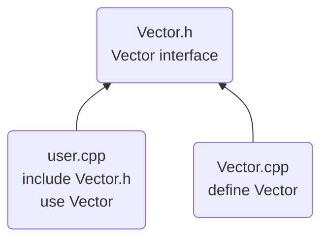

#header #module #library #namespaces #functionArguments #returnValues

---
# Introduction
---
The most important step to clearly define the interactions among C++ components (functions, user-defined types, class hierarchies, templates) is to distinguish between the interface to a part and its implementation.

One entity can have many declarations, but only one definition.

---
# Separate Compilation
---
It can be done in 2 ways:
- Place declarations in separate files, called _header files_, and `#include` them where needed.
- Define _module files_, compile them separately, and `import` them where neede.

Cons:
- Minimize compilation time
- Separate logically distinct parts `->` less error
	-_code hygiene_ (cute term ><)

_Library_: collection of separately compiled code fragments (e.g. functions)

### Header Files
Traditionally, in _header files (HF)_ we place declarations that specify the interface to a piece of code we consider a module.

A _cpp_ file (compiled by itself) and the HFs it includes consist a _translation unit_.

HFs is a very old way of simulating modularity. 
__Disadvantages__ of HFs:
1. __Compilation time__: If you `#include` a HF in 101 translation units, it will be compiled 101 times.
2. __Order dependencies__: If you `#include` HF2 before HF1, that may affect the meaning of the code.
3. __Inconsistencies__: Defining an entity in one file and then doing it again in another file slightly differently can lead to crashes and subtle errors.
4. __Transitivity__: HFs including other HFs leads to code bloat.

